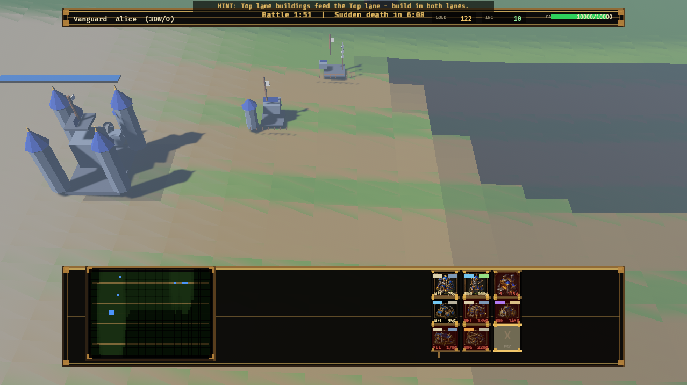
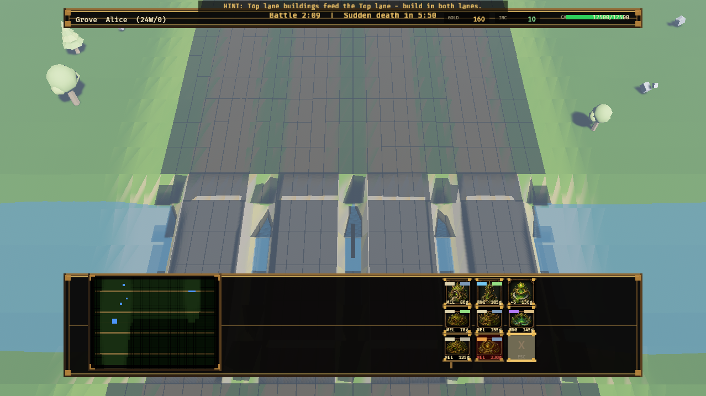
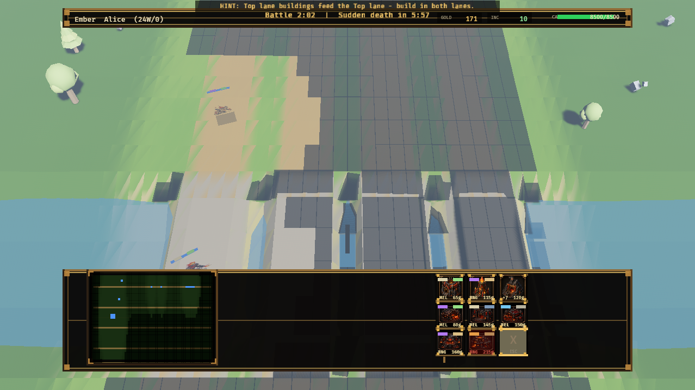
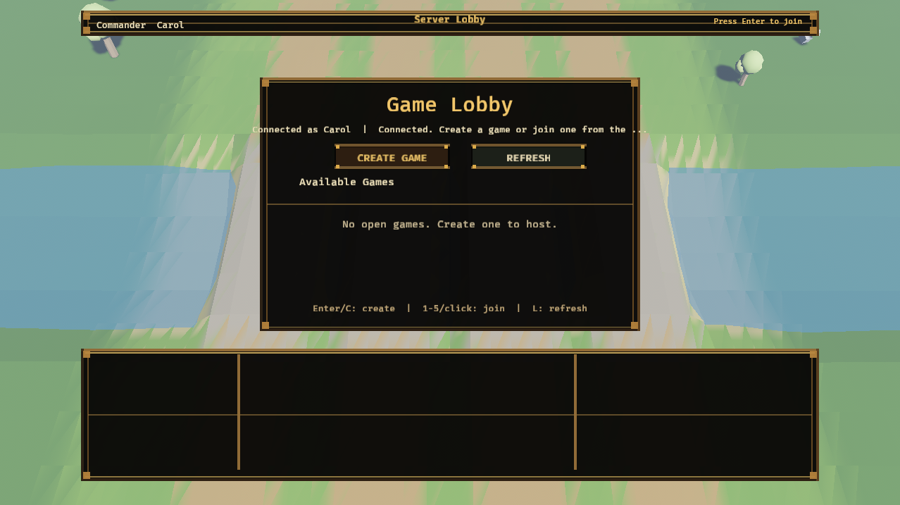
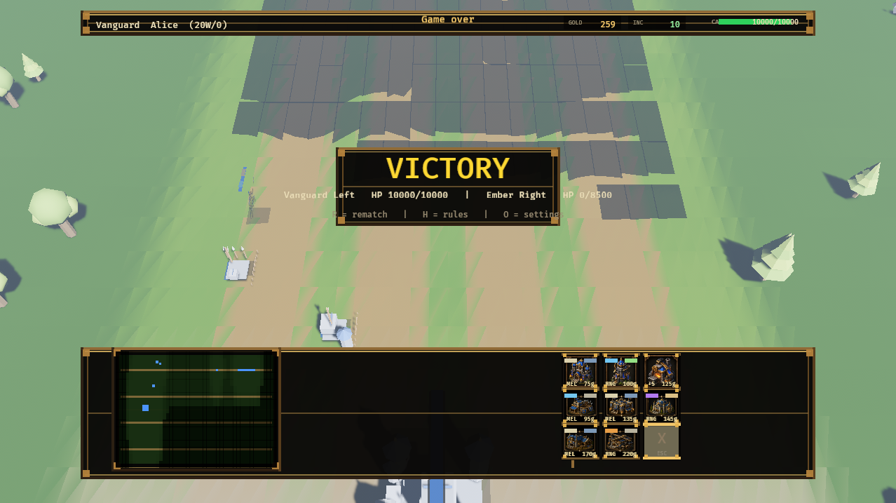
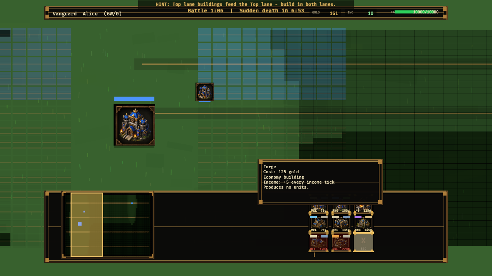
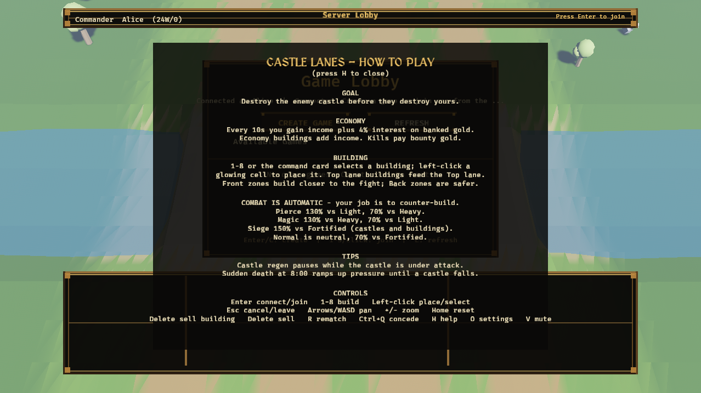
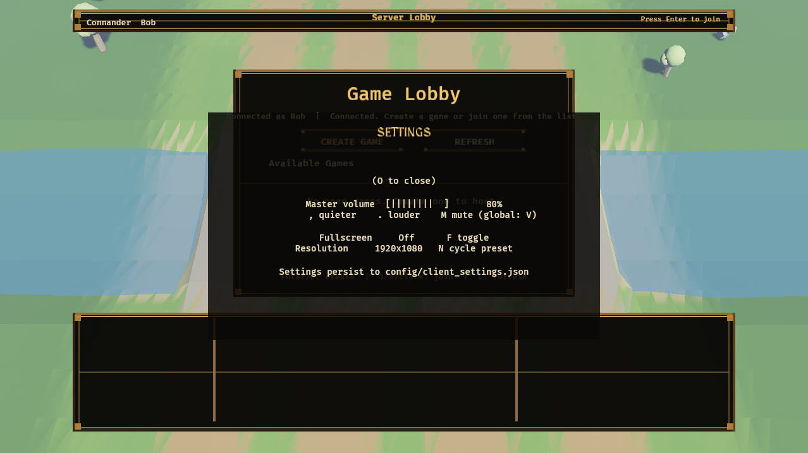
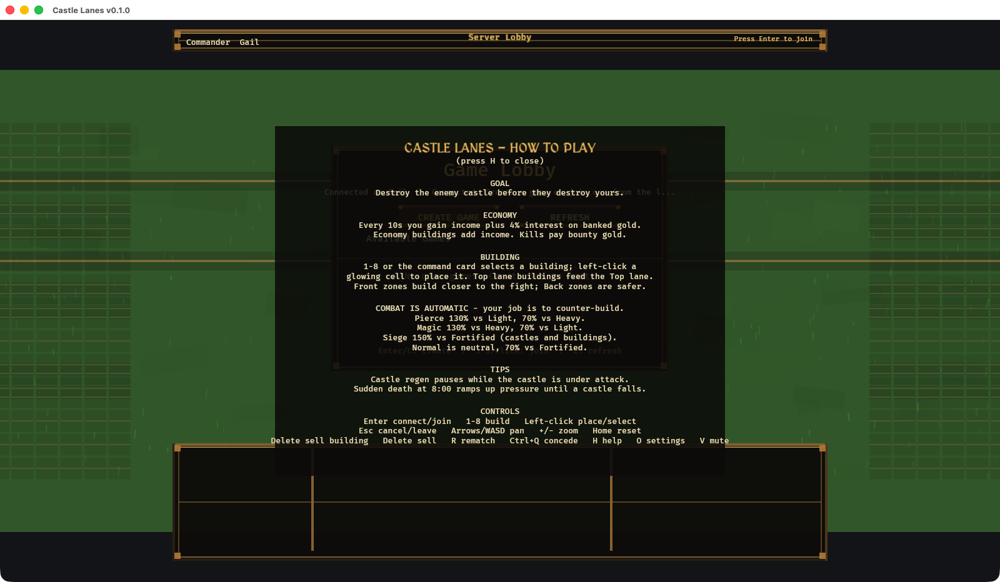
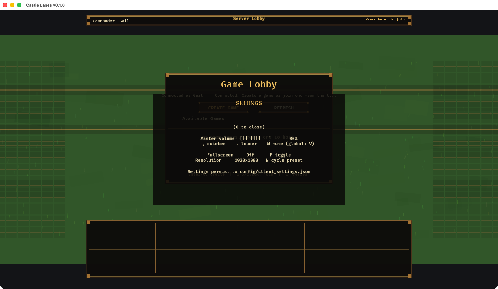

# Castle Lanes

Castle Lanes is a native desktop Rust/Bevy game inspired by the builder-autobattler shape of classic custom RTS maps (original names and art). Authoritative deterministic UDP server, procedural low-poly 3D world with one shared sun, Blender-authored glTF armies, and a Warcraft-3-style build/placement loop.

**Current release: v0.2.0** — the "WC3-style low-poly 3D" overhaul (plan: [docs/plan-0.2.md](docs/plan-0.2.md)). Highlights:

- Heightfield terrain: castle highlands, lane roads, a water channel with stone bridges, and a wilderness ring with trees and rocks.
- One shadow-mapped sun + distance haze; every unit and building is a Blender-authored low-poly glTF model (models are code under `tools/blender/`), with the v0.1 2D renderer kept behind `--renderer2d`.
- WC3-style placement: grid appears only while building, ghost preview with valid/invalid tint, animated build circle, scaffold state on fresh buildings.
- Same deterministic sim and protocol as v0.1 — replays, matchmaking, and team play unchanged.



More views — the HUD, lobby, and overlays all fit a 1600×900 window without scrolling:

| The Vanguard castle and terrace (shared sun, blob shadows) | Grove match over the water channel and bridges |
| --- | --- |
|  |  |

| Ember match on the enemy shore | Game browser over the 3D field |
| --- | --- |
|  |  |

| Victory on the 3D field | 2D fallback renderer (--renderer2d) |
| --- | --- |
|  |  |

| Help overlay (H) | Settings overlay (O) |
| --- | --- |
|  |  |

| Help overlay (H) | Settings overlay (O) |
| --- | --- |
|  |  |

## Run

With [Task](https://taskfile.dev/), common commands are available through `Taskfile.yml`:

```bash
task run-server
task run-client
task run-demo-client
task run-bot
task verify
```

Start the authoritative dedicated server:

```bash
cargo run --bin castle_lanes_server -- 127.0.0.1:4000
```

Start two clients in separate terminals:

```bash
cargo run --bin castle_lanes_client -- --name Alice --server 127.0.0.1:4000
cargo run --bin castle_lanes_client -- --name Bryn --server 127.0.0.1:4000
```

Or run one visible client against a headless scripted peer:

```bash
cargo run --bin castle_lanes_client -- --name Alice --server 127.0.0.1:4000 --race grove --auto-ready --auto-build-demo
cargo run --bin castle_lanes_bot -- --name Bryn --server 127.0.0.1:4000 --race ember
```

## Controls

- `Enter`: join or reconnect to the server.
- Choose a race in the opening modal, then click `Ready`.
- `1`-`8`: select one of your race's buildings.
- Click the 3x3 command card in the bottom command frame for mouse-first play.
- `Esc` or the `X` command-card slot cancels building placement.
- Left click your highlighted build grid to place the selected building while placement mode is active. A successful placement clears the build cursor.
- Left click a unit, building, castle, or build cell to inspect it in the command frame.
- Arrow keys: pan the camera.
- `+`, `-`: zoom the camera.
- `Home`: reset the camera.
- `R`: vote for rematch after game over.
- `Ctrl+Q`: concede the match (your castle falls; the opponent wins).
- `Delete`: sell the selected own building for a 70% refund.
- `U` / `I`: upgrade the selected own building into one of its two branches (e.g. Range Tower to Arbalest Tower or Arcane Spire). Upgrades change the produced unit, heal the building, and make it sell for 70% of the upgraded value.
- `H`: open or close the in-game help/rules overlay.
- `V`: mute or unmute all sound (persisted to `config/client_settings.json`).
- `O`: open the settings panel — `,`/`.` adjust volume, `M` mute, `F` fullscreen, `N` cycle resolution preset. Everything persists to `config/client_settings.json`.
- `--race vanguard|grove|ember`: client/bot flag for demo/test race selection.
- `--auto-ready`: client flag for demo/test runs that readies after joining.
- `--auto-build-demo`: client flag for demo/test runs that places your first race building after match start.
- `--show-help` / `--show-settings`: client flags that open with the corresponding overlay visible (capture/demo aid).

Players must choose a race before readying. The server rejects ready commands until a race is selected.

Disconnecting during a match does not destroy it: the seat is reserved for 90 seconds and the same name can rejoin the game from the lobby to resume. If the grace window lapses, the match resets to the lobby.

## Balance Config

Tune races, castle HP, economy timing/interest, building costs, spawn timers, income bonuses, unit stats, and unit bounties in:

```text
config/balance.json
```

The dedicated server loads this file at startup. Clients receive the active balance once during join, then regular match snapshots only carry live match state.

## Core Direction

- Native desktop is the current target. Browser support is possible later, but the game work is focused on the native Bevy client and dedicated server first.
- The game should feel like a classic RTS custom-map autobattler, but with original races, units, buildings, art, and naming.
- We chose a 2.5D direction instead of jumping to full 3D. The simulation now moves toward real spatial RTS behavior while the renderer keeps the readable isometric-ish 2D style.
- The server stays authoritative. Clients send player intents only; health, economy, spawns, movement, collision, combat, bounties, victory, and rematch state belong to the server.
- Lanes remain a strategic concept, but units now have real 2D simulation positions, velocity, and radius. This lets us add spacing, body blocking, better combat readability, and future pathing without rewriting the entire game into 3D.
- Fog of war uses client-side explored memory for presentation, while current visibility still comes from the replicated server snapshot and local reveal rules.

## Art

Generated original art lives in:

```text
assets/art/
```

The client uses a procedural neutral grass battlefield with subtle animated blades and code-drawn RTS-style panels/buttons for the current UI pass.
Unit sprites live in `assets/art/units/`; the generated atlas source is kept alongside the cropped transparent PNGs for future edits.
Building command icons live in `assets/art/buildings/` and are used by the build toolbar.

See [docs/assets.md](docs/assets.md) for the asset creation pipeline, prompt shape, crop/key process, and client integration notes.

## MVP Rules

- 1v1 only: Left vs Right.
- Races: Vanguard, Grove, Ember.
- Each race has unique castle HP and eight unique buildings: seven unit producers plus one economy building.
- Starting gold, base income, income interval, interest rate, race HP, building HP, buildings, and unit stats are configured in `config/balance.json`.
- Economy ticks every configured interval. The default is 10 gold every 10 seconds plus floored interest from unused banked gold, currently 4%.
- The battlefield has two lanes: Top and Bottom. Buildings are placed into lane-specific Front or Back zones.
- Unit-producing buildings spawn units from their own lane and grid position, so top buildings feed the top lane and bottom buildings feed the bottom lane.
- Units prioritize enemy units first. Lanes are separate in the field, but connect inside castle junction zones so defenders can attack cross-lane enemies near a castle. After units, attackers target same-lane enemy Front buildings, then the enemy castle. Back buildings do not tank for the castle.
- Units use 2.5D spatial positions with collision radius, spawn-space search, and deterministic separation so waves do not spawn or fight inside each other.
- Units have attack and armor types. The current table is Warcraft-3-inspired: Magic is strong into Heavy and weak into Light, Pierce is strong into Light and weak into Heavy, and castles use Fortified armor.
- Units also expose movement speed, attack speed, attack range, and attack mode (`Melee` or `Ranged`) through `config/balance.json`; the client shows these in the inspect/build UI.
- Each unit has a configured bounty. Killing a unit awards that gold to the killer's team.
- Unit `damage` is a midpoint, not a fixed number. `damage_variance: 0.10` means a unit with `50` damage rolls from `45` to `55` before attack/armor multipliers are applied.
- The client renders inferred combat readability effects from server snapshots: floating high-contrast damage numbers, attack-type streaks, hit bursts, structure impact chips, and bounty text. Team colors (Left blue, Right red) mark units, health bars, buildings, castles, minimap dots, and bounty text.
- Unit sprites interpolate between server snapshots and animate on the display clock, so motion is smooth even though snapshots arrive at 10 Hz.
- All sound effects are procedurally synthesized by `tools/gen_sfx.py` (run it to regenerate `assets/audio/*.wav`); music is a quiet ambient drone.
- Castle regeneration pauses for `castle_regen_delay_secs` after taking damage, so early pressure sticks instead of being healed off.
- Sudden death starts at `sudden_death_start` (8:00) and its pressure ramps at `sudden_death_ramp_per_minute` per minute until a castle falls.
- The simulation is deterministic per match seed (verified by unit tests); `cargo run --release --example sim_balance -- --games 25` replays bot-vs-bot matches to produce `docs/balance-report.md`.

The server owns all gameplay state. Clients send only join, ready, placement, and rematch intents.
